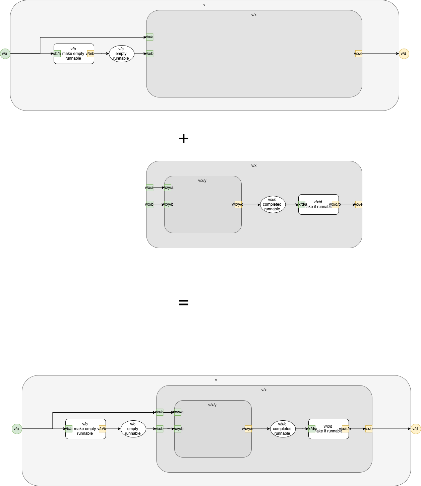

# Introduction

At this point, we have parsed 4 components - v, v/x, v/x/y and v/x/y/z.

We are avoiding parsing the left-overs, z and c, for now. We think that the details will not be of help in designing and debugging the process (we'll see if that assumption is correct, later).

# Join - Simple

Let's join two components and build from there.

Let's join v and v/x.

We write a simple bash script
```
#!/bin/bash
# join two .pl files and re-sort into the final .pl file
# inputs: $1, $2
# output: $3.pl
cat $1.pl $2.pl > _temp
sort _temp >$3.pl
```
and run it
```
./join.bash v v_x inc
```

Next, we run our query:
```
pseudo % ./run-qr.bash inc
inc
component IDs [v_0,v_3,v_7,v_9,v_x_0,v_x_10,v_x_4,v_x_8]
components    [v,v_b,v_c,v_x,v_x,v_x_d,v_x_y,v_x_c]
ports [v_a,v_x_a,v_x_b,v_x_c,v_d,v_b_a,v_b_b,v_x_a,v_x_d_a,v_x_d_b,v_x_b,v_x_c,v_x_y_a,v_x_y_b,v_x_y_c]
links [v_b,v_x,v_x_d,v_x_y]
arrows [[[v_a,v_b_a]],[[v_a,v_x_a]],[[v_b_b,v_c]],[[v_c,v_x_b]],[[v_x_c,v_d]],[[v_x_a,v_x_y_a]],[[v_x_b,v_x_y_b]],[[v_x_c,v_x_d_a]],[[v_x_d_b,v_x_e]],[[v_x_y_c,v_x_c]]]
```

and see that the joined component `v/x` is still being reported as a `link`, and, `v/x` is reported twice in the components list.

After joining `v` and `v/x`, we should see 3 link components `v/x/y`, `v/b/` and `v/x/d`.

The list of links currently includes `v/x`. We need to modify our factbase and our query.

Joining _should_ make `v/x` into a sub-component of `v`.

We want to change `v`s notion of `v/x`.

What if we try to knock out the chain of declarations of `v/x` from `v`? 

Let's try that with a simple manual edit.

As humans who are getting really, really bored, we edit v.md for this test.

## Low Level Test 1
We make the manual edit and get
```
pseudo % ./run.bash 
pseudo % ./join.bash v v_x inc
pseudo % ./run-qr.bash inc
inc
component IDs [v_0,v_3,v_7,v_x_0,v_x_10,v_x_4,v_x_8]
components    [v,v_b,v_c,v_x,v_x_d,v_x_y,v_x_c]
ports [v_a,v_d,v_b_a,v_b_b,v_x_a,v_x_d_a,v_x_d_b,v_x_b,v_x_c,v_x_y_a,v_x_y_b,v_x_y_c]
links [v_b,v_x_d,v_x_y]
arrows [[[v_a,v_b_a]],[[v_a,v_x_a]],[[v_b_b,v_c]],[[v_c,v_x_b]],[[v_x_c,v_d]],[[v_x_a,v_x_y_a]],[[v_x_b,v_x_y_b]],[[v_x_c,v_x_d_a]],[[v_x_d_b,v_x_e]],[[v_x_y_c,v_x_c]]]
```

Now, `v/x` does not appear as a link and appears only once in the components list.

Actually, that's not quite correct (our test is lying to us).

We want to replace the v/x hierarchy in v.md with the v_x.md hierarchy.

Again, that's not quite right.

We want
1. to demote `v/x` by one level (## instead of # and so on)
2. paste the demoted version into `v` after deleting `v/x` from `v`.

```
pseudo % ./run.bash
pseudo % ./join.bash v v_x inc
pseudo % ./run-qr.bash inc    
inc
component IDs [v_0,v_13,v_17,v_19,v_3,v_7,v_9,v_x_0,v_x_10,v_x_4,v_x_8]
components    [v,v_x_y,v_x_c,v_x_d,v_b,v_c,v_x,v_x,v_x_d,v_x_y,v_x_c]
ports [v_a,v_x_a,v_x_b,v_x_c,v_x_y_a,v_x_y_b,v_x_y_c,v_d,v_x_d_a,v_x_d_b,v_b_a,v_b_b,v_x_a,v_x_d_a,v_x_d_b,v_x_b,v_x_c,v_x_y_a,v_x_y_b,v_x_y_c]
links [v_x_y,v_x_d,v_b,v_x_d,v_x_y]
arrows [[[v_a,v_b_a]],[[v_a,v_x_a]],[[v_b_b,v_c]],[[v_c,v_x_b]],[[v_x_a,v_x_y_a]],[[v_x_b,v_x_y_b]],[[v_x_c,v_d]],[[v_x_c,v_x_d_a]],[[v_x_d_b,v_x_e]],[[v_x_y_c,v_x_c]],[[v_x_a,v_x_y_a]],[[v_x_b,v_x_y_b]],[[v_x_c,v_x_d_a]],[[v_x_d_b,v_x_e]],[[v_x_y_c,v_x_c]]]

```

That's better, but still no cigar.  `V/x/y` and `v/x/d` appear twice in the links (and other places).  Maybe something is wrong with
1. our manual edit
2. our query, or,
3. something else.

We can view this join as a .

This diagram shows what we want to do. The exising arrows in `v` can remain, since they connect to `v/x` but do not penetrate the boundaries of `v/x`.

In a more automated version, we would want to convert circles in `v/x` into rects. Or would we?

_unifinished - experimenting with .png files and .md_


# See Also

[References](https://guitarvydas.github.io/2021/01/14/References.html)
[Table of Contents](https://guitarvydas.github.io/2021/05/14/Table-Of-Contents.html)

<script src="https://utteranc.es/client.js" 
        repo="guitarvydas/guitarvydas.github.io" 
        issue-term="pathname" 
        theme="github-light" 
        crossorigin="anonymous" 
        async> 
</script> 
