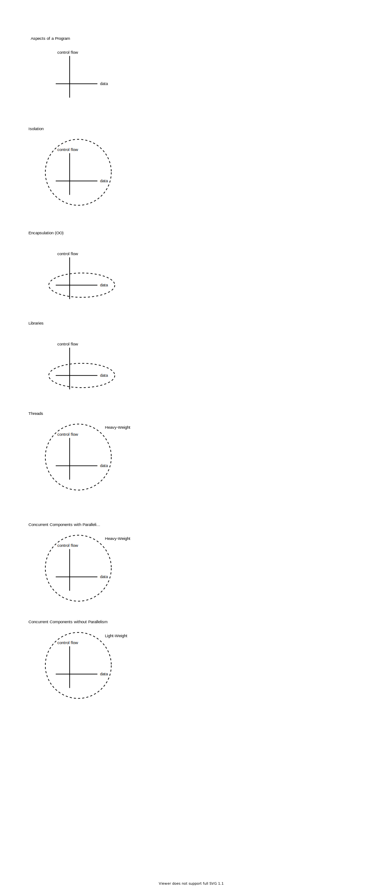

# Isolation
[Isolation](./Composition-Isolation.svg)

# Blocking Due To Call Return

[Blocking Due To Call Return](./Composition-Blocking%20Due%20To%20Call%20Return.svg)
# Appendix - See Also
[Blog](https://guitarvydas.github.io)
[Table of Contents as of Dec. 01, 2021](https://guitarvydas.github.io/2021/12/01/Table-of-Contents-December-01-2021.html)
[Videos](https://www.youtube.com/channel/UC2bdO9l84VWGlRdeNy5)
[References](https://guitarvydas.github.io/2021/01/14/References.html)

 
