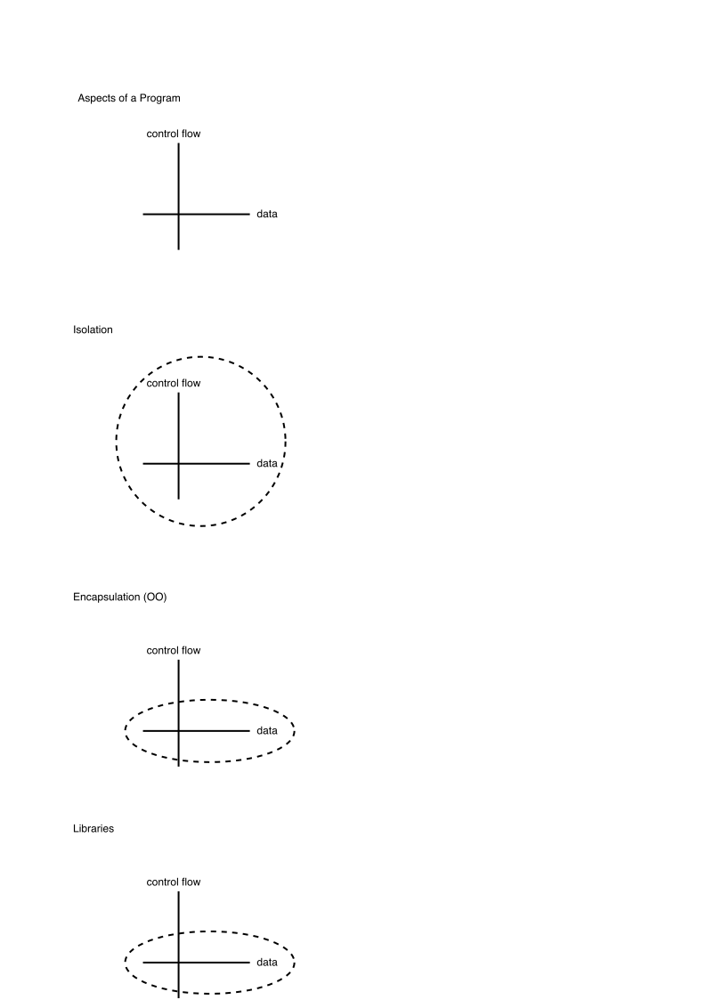

# Isolation
a [Isolation](./isolation.svg)
b 
c [Isolation](./isolation.png)
d 
e [Isolation](./isolation.pdf)
f 
g [Isolation](/assets/isolation.svg)
h 
i [Isolation](/assets/isolation.png)
j 
k [Isolation](/assets/isolation.pdf)
L 

# Blocking Due To Call Return

[Blocking Due To Call Return](./Composition-Blocking%20Due%20To%20Call%20Return.svg)
# See Also

[Table of Contents](https://guitarvydas.github.io/2021/12/10/Table-of-Contents-Dec-01-2021.html)
[Blog](https://guitarvydas.github.io)
[Videos](https://www.youtube.com/channel/UC9EJr0nKHwadbHUtc5zHdmQ/videos)
[References](https://guitarvydas.github.io/2021/01/14/References.html)

 
