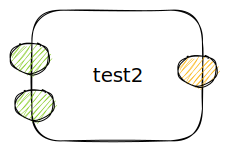

testing with an excalidraw image

%%[🖋 Edit in Excalidraw](../Excalidraw/2023-09-19-Test%202023-09-19%2011.46.18.excalidraw.md), and the [dark exported image](../Excalidraw/2023-09-19-Test%202023-09-19%2011.46.18.excalidraw.dark.svg)%%

2nd try saving in folder '@blogs/diagrams'

%%[🖋 Edit in Excalidraw](diagrams/2023-09-19-Test%202023-09-19%2011.50.16.excalidraw.md), and the [dark exported image](diagrams/2023-09-19-Test%202023-09-19%2011.50.16.excalidraw.dark.svg)%%

end test

