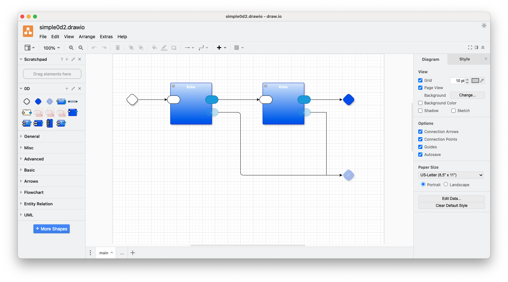

# Diagram and Trace



```
--- routing traces ---

⟹  main.“” ⟪“”₋“@1”⟫
  ↓ main.“” ➔ main.Echo₀.“” ⟪“”₋“@1”⟫
    ⋯ main.Echo₀.“” ∴ main.Echo₀.“” ⟪“”₋“@1”⟫
      → main.Echo₀.“” ➔ main.Echo₁.“”  None
        ⋯ main.Echo₁.“” ∴ main.Echo₁.“” ⟪“”₋“@1”⟫
          ↑ main.Echo₁.“” ➔ main.“” ⟪“”₋“@1”⟫
--- done ---
```

# How to read the trace:
- each line is indented sequentially
- each line begins with a routing operation
  `⟹` inject external message
  `↓` route downwards (from input gate to a child's input port)
  `→` route across (from child's output port to a child's input port)
  `↑` route up (from child's output port to output gate)
  `⇶` route through (from input gate to output gate) (useful for stubbing out components during development)
  `⋯` invoke child's handler which enqueues a message on its output port

## Messages are formatted as:
`⟪“”₋“@1”⟫`
- port name vs. message payload
- during bootstrap, all portnames are strings, all payloads are strings (to accomodate readability of bootstrap intermediate results)

## Example
The below output is read as:
1. inject message `⟪“”₋“@1”⟫` into component `main` on port `""` (the "@1" is a string payload that reminds me of the test number (#1 in this case))
2. invoke sub-component `main.Echo₀` to handle a message on port `""`, the message is `⟪“”₋“@1”⟫`
   - in this case `main` is the tab name of the top-level diagram, and `Echo₀` is the 0'th instance of the `Echo` template that belongs to `main`
   - each Container component generates a set of unique instances of template components specific to the Container
   - note that a Container may contain other Containers - these are recursively instantiated before the run
3. an output message from `main.Echo₀` from port `""` is routed across to `main.Echo₁` on its input port `""`
4. `main.Echo₁` is invoked and it generates a single output message on its `""` output port
5. the output message from `main.Echo₁` is routed upwards to the `""` output port (gate) of `main` 

```
--- routing traces ---

⟹  main.“” ⟪“”₋“@1”⟫
  ↓ main.“” ➔ main.Echo₀.“” ⟪“”₋“@1”⟫
    ⋯ main.Echo₀.“” ∴ main.Echo₀.“” ⟪“”₋“@1”⟫
      → main.Echo₀.“” ➔ main.Echo₁.“”  None
        ⋯ main.Echo₁.“” ∴ main.Echo₁.“” ⟪“”₋“@1”⟫
          ↑ main.Echo₁.“” ➔ main.“” ⟪“”₋“@1”⟫
--- done ---
```

## Bugs? In need of further investigation
- on line 4, the displayed message is `None` - this should be a message, not `None`
- what will be displayed when a component produces more than one output?
  - on the same output port?
  - on different output ports?
- this Trace shows all routings, what if we only want a backtrace of a specific message?
  - hints to self: 
	- each routed message should be tagged with the routing descriptor that caused it
	- we should be able to follow the trace backwards starting at a specific output message, displaying only a trace of how the message was generated
	- a Trace is really a tree of Traces
		1. when looked at in the forward direction, we should see a tree
		2. when looked at in the backwards direction, we should only only see a single backtrace (trace thread) 
  

# Appendix - See Also

### References

[https://guitarvydas.github.io/2004/01/06/References.html](https://guitarvydas.github.io/2024/01/06/References.html)

### Blog
[blog](https://guitarvydas.github.io/)

### Blog
[obsidian blogs](https://publish.obsidian.md/programmingsimplicity) (see blogs that begin with a date 202x-xx-xx-)
### Videos
[videos - programming simplicity playlist](https://www.youtube.com/@programmingsimplicity2980)
### Pamphlets
[DSL for Writing DSLs](https://tarvydas.gumroad.com/l/hiypq?_gl=1*1bdn1r0*_ga*NTI5MDkzNTI0LjE3MTAzNTQzNjU.*_ga_6LJN6D94N6*MTcxMTQ4ODE0Mi43LjAuMTcxMTQ4ODE0Mi4wLjAuMA..)

[Is Concurrency Difficult?](https://tarvydas.gumroad.com/l/dvtej?_gl=1*o7hy6z*_ga*MjA0NzUyMDY1Mi4xNzA3NDc3MDIx*_ga_6LJN6D94N6*MTcwNzQ3NzAyMC4xLjEuMTcwNzQ3NzI5Ni4wLjAuMA..)
### Discord
[Programming Simplicity](https://discord.gg/Jjx62ypR) all welcome, I invite more discussion of these topics, esp. regarding Drawware and 0D
### Twitter
@paul_tarvydas
### Books (WIP)
[leanpub](https://leanpub.com/u/paul-tarvydas)

<script src="https://utteranc.es/client.js" 
        repo="guitarvydas/guitarvydas.github.io" 
        issue-term="pathname" 
        theme="github-light" 
        crossorigin="anonymous" 
        async> 
</script> 
